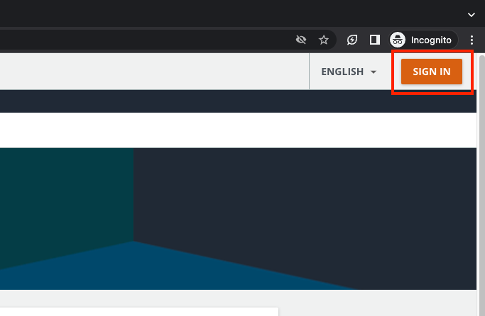
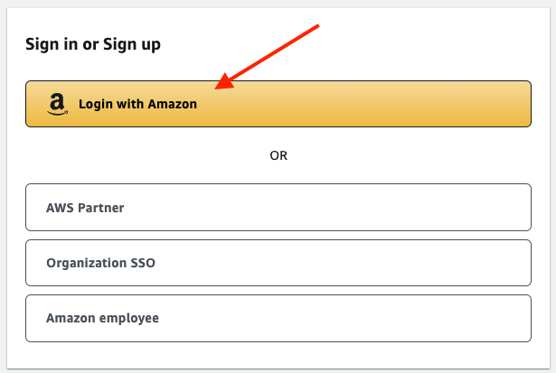
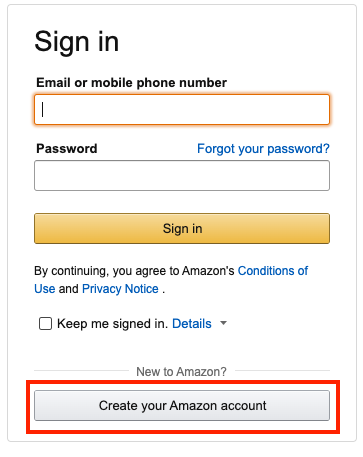

# Create SkillBuilder Account 

1. Go to https://skillbuilder.aws/
2. From right top corner choose "Sign In"

3. Use the "Login with Amazon" option

4. If you have an amazon.com account you can use it sign in directly
5. If you don't have such choose the oprion "Create your Amazon account"

6. You'll need to fill in account information, enter the OTP code send to your email and verify your mobile number

7. Once you have the Amazon.com account, get back and log in to the SkillBuilder page

8. When you are logged in use the links in the home page of this repo to access the learning materials